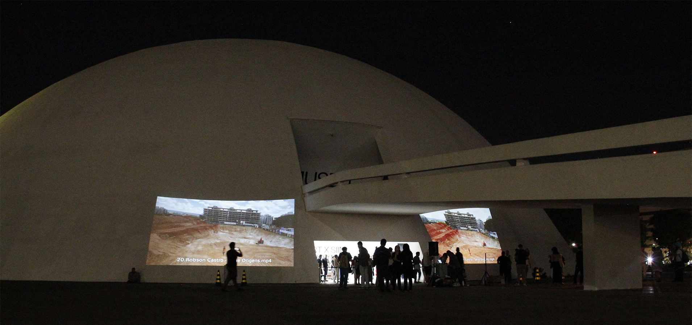
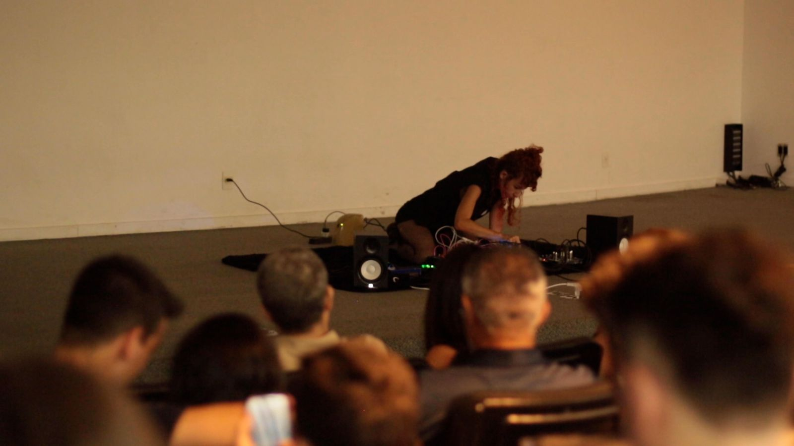

  

  <h1>Performances | Projeções </h1>

  <h3>Projeções extenas</h3>
  
  <ul style="list-style: square;">
    <li>Leonardo Branco e Antenor Ferreira  | Antropofagias Digitais (2023) </li>
    <li>Luciano Mendes, Carina Flexor, Maurício Fonteles, Lucianna Ávila e Marcos Bezerra | Aigafoportna( 2023) </li>
    <li>Isabel Perez Pulgar e Antenor Ferreira  | Canibalia (2023) </li>
    <li>Melissa  Faivre  | The becoming (2023) </li>
    <li>Suzete Venturelli  |  Cavalo Banana Coco Natureza (2023) </li>
    <li>Lilian Amaral e Grupo  |  HOLOS DESIERTO/INUNDACIÓN (2023) </li>
    <li>Luciano Mariz | Tudo que é luz desmancha no pixel (2023) </li>
    <li>Flávio Carvalho Multiple  |  Faces of the Void (2023) </li>
    <li>Alejandro Casales   | Re-morse (2023) </li>
    <li>AMANTE:|:DA:|:HERESIA (Leo Pimentel )  | 0rfr1dAb0rg a Ext3rminAd0rA do prEs3ntE diStÓpic0 (2020) </li>
    <li>Kelly Oliveira |  Eîori! um horizonte existencial  (2023) </li>
    <li>Victor Valentim e Anibal  |  Ginófitas (2022) </li>
    <li>Camila Torres e Gabriel Tye | Fitando Pedras (2023) </li>
    <li>Alexandre Villares Grafos  |  Voláteis 2023-8 (2023) </li>
    <li>Lynn Carone | EntreMundos  (2023) </li>
    <li>Pedro Lacerda  |  Culto-sinfonia (2023) </li>
    <li>Denise Camargo | Série Incitações (2023) </li>
  </ul>
  <h3>Performances</h3>
  
  
  <ul style="list-style: square;">
    <li>Antenor Ferreira Corrêa </li>
    <li>De Céu e Concreto | Ianni Barros Luna </li>
    <li>Rostos nômades  | Tatiana dos Santos Duarte</li>
    <li> Musichackers de Brasília (Francisco Raupp, Guilherme Lazzaretti e Leo Pimentel)</li>
  </ul>
  

